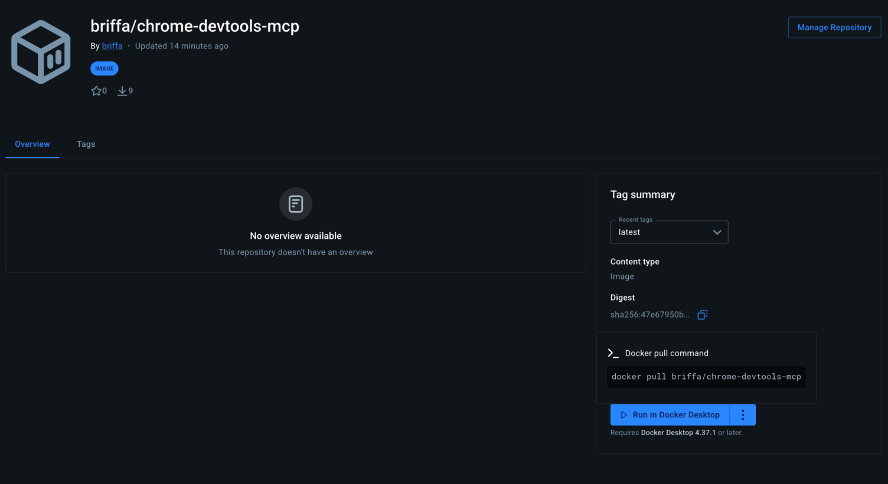
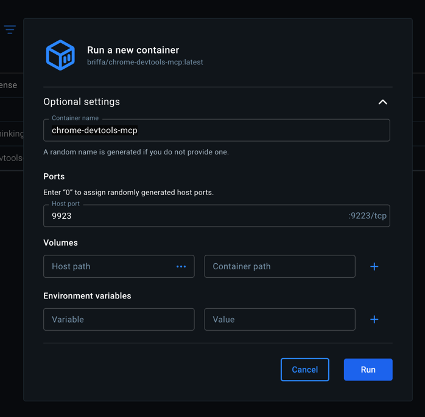

# Chrome DevTools MCP Server

Run Chrome DevTools MCP in Docker and connect it to your IDE.

### Important Information

- `<host-port>` - The port on your machine (e.g., 9223, 9221). This is what you'll use in your IDE's MCP config URL.
- `9223` - The port the MCP server exposes inside the container. This stays fixed.
- `<docker-username>` - The Docker Hub username the image is published under (e.g., `mintoff`).
- `192.168.65.1` - Default common IP address of Docker on host machine.
- `9222` - Chrome debugging port (chosen arbitrarily by me)

## Pull Docker Image

Command: `docker pull briffa/chrome-devtools-mcp`

Link: https://hub.docker.com/r/briffa/chrome-devtools-mcp



## Run Docker Container

### From docker hub (desktop application)

- ALWAYS Specify host port (default. 9223)
- [PREFERRED] Specify name i.e. `chrome-devtools-mcp`



### or connect from terminal
```bash
docker run -d --name chrome-devtools-mcp -p 9223:9223 <docker-username>/chrome-devtools-mcp:latest
```

## Connect your MCP Client (kiro, claude etc.)

Add to your MCP config i.e. `mcp.json`:

```json
{
  "mcpServers": {
    "chrome-devtools": {
      "url": "http://localhost:<mounted-host-port>/sse"
    }
  }
}
```

## Open Chrome tab with debugging port

```open -n -a /Applications/Google\ Chrome.app/Contents/MacOS/Google\ Chrome --args --user-data-dir="/tmp/chrome_dev_test" --profile-directory="Default" --no-first-run --no-default-browser-check --remote-debugging-port=9222 --remote-debugging-address=192.168.65.1```

## Change Host Port

```bash
docker stop chrome-devtools-mcp
docker rm chrome-devtools-mcp
docker run -d --name chrome-devtools-mcp -p <new-host-port>:9223 <docker-username>/chrome-devtools-mcp:latest
```

Update your IDE's MCP config to use the new port (e.g., `http://localhost:9221/sse`).

## Useful Commands

```bash
docker logs chrome-devtools-mcp    # View logs
docker stop chrome-devtools-mcp    # Stop
docker start chrome-devtools-mcp   # Start again
```
